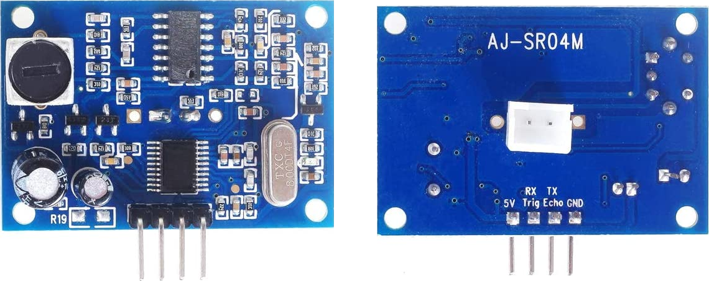
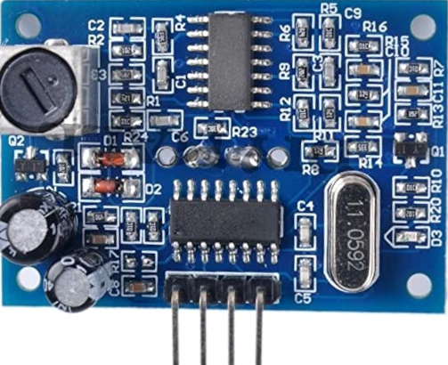
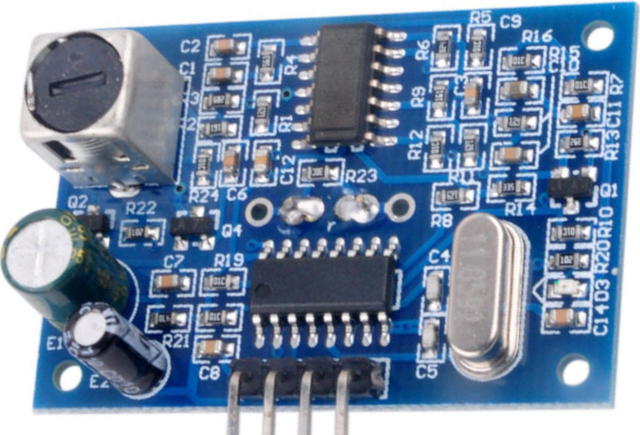
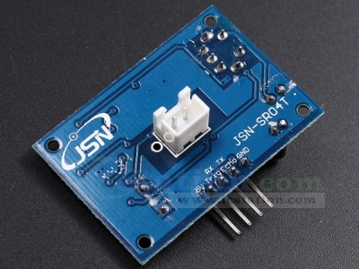
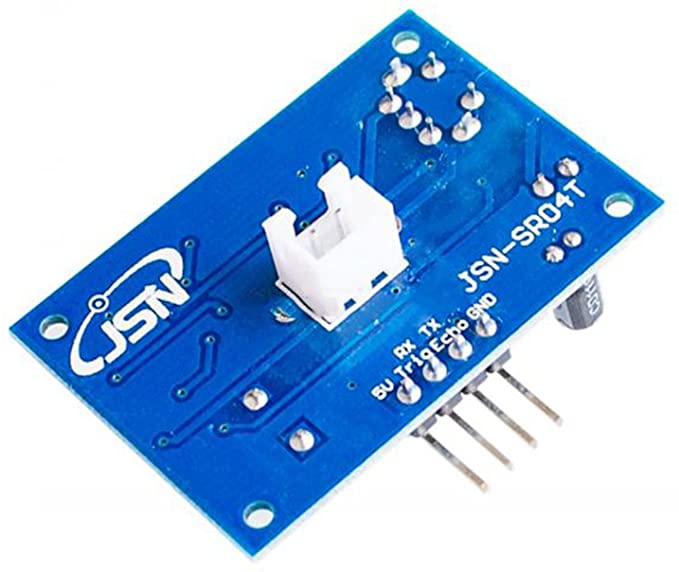
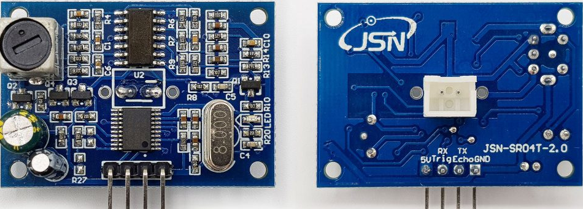
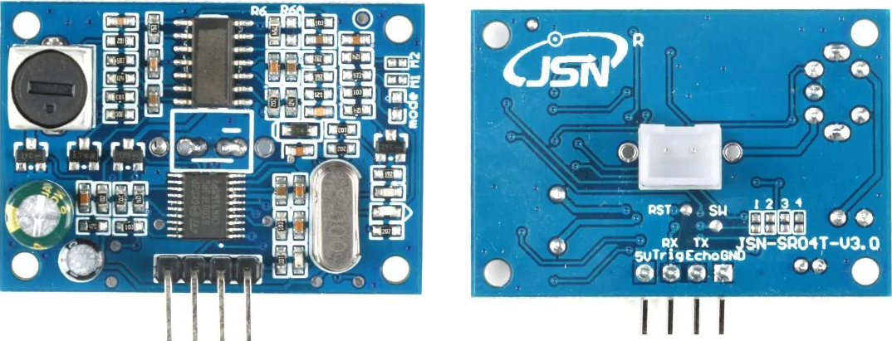

The current state of the project is still in development.
Which means changes on hardware or design are anytime possible.

## Some information we gathered during previous collective orders

The most sensible parts of the OBS are the two ultrasonic sensors.
There are different models on the market, but most sold under the same description, JSN-SR04T.

### AJ-SR04M

characteristics:
- resistor R17 to control the behavior
- 8 MHz crystal
- working voltage range 3 - 5.5 volt

documentation:

https://github.com/tomaskovacik/kicad-library/tree/master/library/datasheet/K02-AJ-SR04

pictures:

general PCB 
 
 
part from collective order Feb 2021 

### JSN-SR04T

characteristics:
- probably no resistor to control the behavior
- transverse IC on the connector side
- 11.095 MHz crystal
- working voltage 5 volt

documentation:

- https://web.archive.org/web/20180712193526/http://www.ekt2.com/pdf/412_CH_ULTRASONIC_MODULE_4PIN_WATERPROOF.pdf
- a document found often cited on chinese webpages JSN-SR04T一体化超声波测距说明书.pdf, no free download found 

pictures:

front 1 
 
 
front 2 
 
 
back 1 
 
 
back 2 
 

### JSN-SR04T-2.0

characteristics:
- resistor R27 to control the behavior
- 8 MHz crystal
- working voltage range 3.3 - 5.5 volt

documentation:

https://www.jahankitshop.com/getattach.aspx?id=4635&Type=Product

pictures:

 

### JSN-SR04T-V3.0

characteristics:
- resistor "mode" and the shorts "M1" and "M2" to control the behavior
- 8 MHz crystal
- working voltage range 3.3 - 5.5 volt

documentation:

https://de.aliexpress.com/item/32863960886.html

pictures:

 
